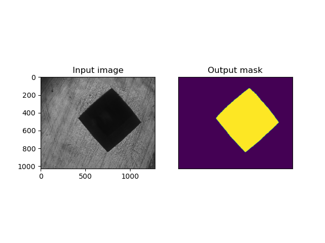

This code repository stores the implementation of the key codes involved in our thesis.

In order to show the results of our work more intuitively, please see this software demo animation below.


If you want to see a clearer picture of the process, please refer to the demo folder.

- SegmentationNetwork:

  The basic implementation of U-Net based on https://github.com/milesial/Pytorch-UNet.

  - Test on our trained model

    One of our trained models has been pre-stored in the SegmentationNetwork directory, named MODEL.pth, you can also find more pre-trained models in the segmentationNetwork/BackupModules folder, just replace the original model file with them, pay attention to modify the file name.
    
    There are several Vickers indentation images stored in the SegmentationNetwork/data directory, and you can easily use them in Pycharm for experimentation. For example, if you want to test data/demo2.bmp, just execute the predict.py script in Pycharm with the following parameters:
    
    ```shell
    -i data\demo2.bmp --viz
    ```
    
    

  - Train your own model

    You can use the Vickers hardness image data set collected by yourself. We recommend using labelme to label the image data. If you don't want to spend too much time and energy on the collection of Vickers image data, you can try to use the Vickers hardness image data set we shared. Although it is not perfect at the moment, I hope it can help you. You can download it by visiting the link below:
    
    https://drive.google.com/drive/folders/1lu8MJZz_jBU9nPpHsYtuajSAb_fV5KHi?usp=sharing

- RoughLoc:

  The basic realization of the coarse positioning algorithm, in the actual application, we use the Qt framework to build the entire software, and use Opencv to perform related image operations. You can easily run the code through the basic Qt installation and opencv call.

  You can see that some Qt-related libraries are used in the algorithm, and the entire algorithm is called through signal slots. This is due to the fact that during actual deployment, we found that some computers with lower performance will take more time to run this part of the code. If deployed in the main thread, this will cause the user interface to freeze. Therefore, we recommend that you run it in a child thread.

  - how to use

    We can use coarse positioning algorithm by calling the following function through the signal slot:

    ```c++
    void IndentMesAlgorithm::slotImgIndentMes(double scale, cv::Mat inputMat, QRectF roi)
    ```
  
    Among them, scale is the zoom factor, inputMat is the image to be processed, roi is the region of interest (you can simply pass in an empty QRectF)

    It is worth noting that there are actually two algorithms in the RoughLocAlgorithm.h/cpp file, they are Max Internal Connect Filed (MICF) and Flood Fill (FF). The MICF method performs rough positioning by finding the largest connected domain. The FF method first searches for the approximate range of the indentation by searching for the largest connected domain, and uses the brightest and darkest points in this range as a reference to fill the area through the Flood Fill method to complete the rough positioning operation. You can choose it in this section:

    ```c++
    switch(gSystemProperty.imaAIMSelect) //This is an enumeration, please refer to the definition in the header file to choose which method to use
        {
            case RoughLocAlgorithm::eAIM_MaxInternalConnectFiled:
            {
                _AIM_MaxInternalConnectFiled(_optMat,_indentRect); //Max InternalConnect Domain Method
                break;
            }
            case RoughLocAlgorithm::eAIM_FloodFill:
            {
                _AIM_FloodFill(_optMat,_indentRect); //Diffuse water filling method
                break;
            }
            default:
            {
    
            }
        }
    ```
  
- tools:

  This folder stores some data annotations and gadgets that may be used during training

  - augmentor: This script will call Augmentor to augment the original pictures in the specified folder and the corresponding annotated pictures. For how to use Augmentor, please refer to: https://github.com/mdbloice/Augmentor
  - remove_name_space: A simple batch file. When you need to use the enhanced image data to train your network, you may need to batch rename all training images. Using this script can easily remove the space characters in the file name after batch renaming to avoid errors when reading the file.
  - trans.py: A script to batch convert labelme labeled json data into pictures. It uses the original labelme_json_to_dataset in the labelme library as the core, converts the json files in the folder in batches, and extracts the corresponding pictures to their respective folders. 
